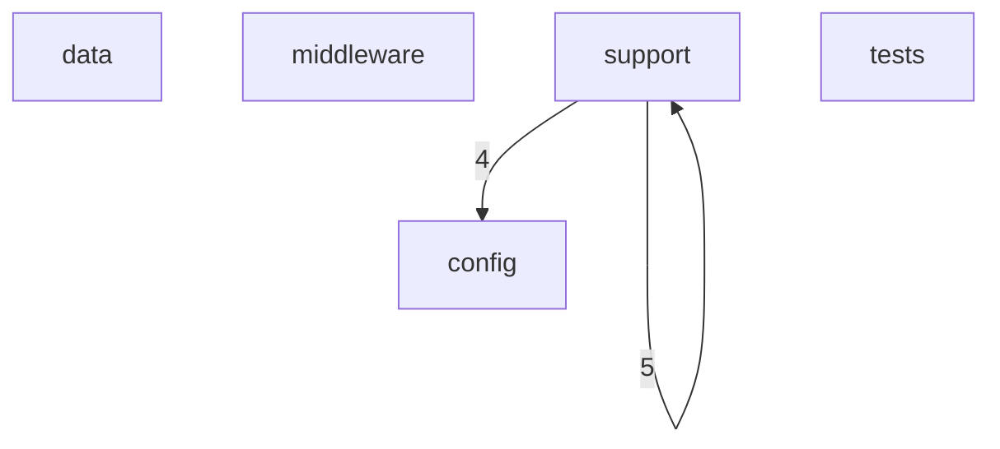
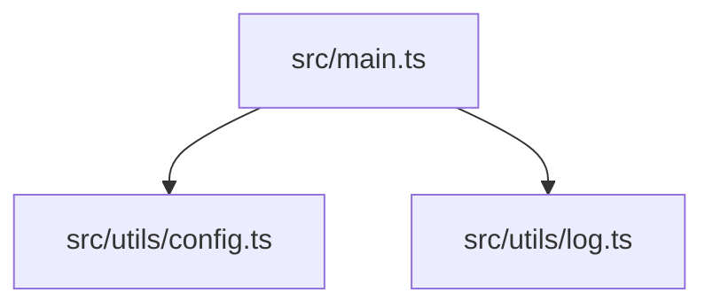
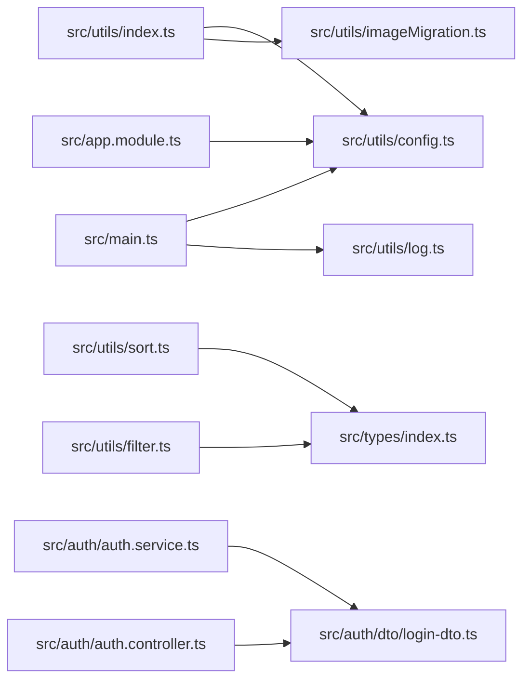

# Flow

## Flow Document Purpose

- Repository: `avion-server-nest`
- Category: `backend`
- This document explains how the codebase is wired together using actual local file imports when they are available.
- Folder names and path categories are used only as a fallback when an exact runtime link is not directly visible from source imports.
- Mermaid diagrams below are repository-local diagrams intended for scanning architecture flow, not pixel-perfect runtime sequence diagrams.
- External services are called out only when the repository declares them in code or package metadata.

## Reading Guide

- `Entry points` are files that appear to bootstrap the app, server, router, or top-level runtime.
- `Outgoing links` are local repository imports from one file to another.
- `Incoming links` are local repository files that import the current file.
- `External packages` are package imports seen in source files and are listed separately from local file links.
- `Flow position` is derived from the file category plus observed import relationships.

## Repository Surface Snapshot

- Total scanned files: `48`
- Files with local outgoing imports: `7`
- Files with local incoming imports: `5`
- Root directories: `4`
- Root files: `12`
- Category count: `5`

## Top-Level Directories

- `.github/`
- `dist/`
- `docs/`
- `src/`

## Top-Level Files

- `.eslintrc.js`
- `.gitignore`
- `.prettierrc`
- `DOCS.md`
- `README.md`
- `nest-cli.json`
- `package.json`
- `pnpm-lock.yaml`
- `pnpm-workspace.yaml`
- `render.yaml`
- `tsconfig.build.json`
- `tsconfig.json`

## Category Inventory

- `config`: `8` files
- `data`: `1` files
- `middleware`: `1` files
- `support`: `36` files
- `tests`: `2` files

## Entry Points

- `src/main.ts`

## Category-Level Diagram

## Entry Flow Diagram

## Hotspot File Diagram

## Category Flow Notes

- `config` exports `0` observed category-to-category local links and receives `4` incoming category links
- `data` exports `0` observed category-to-category local links and receives `0` incoming category links
- `middleware` exports `0` observed category-to-category local links and receives `0` incoming category links
- `support` exports `9` observed category-to-category local links and receives `5` incoming category links
- `tests` exports `0` observed category-to-category local links and receives `0` incoming category links

## File-Level Flow Inventory

### `config` Layer

- File: `src/auth/dto/login-dto.ts`
- Flow position: `config`
- Local outgoing link count: `0`
- Outgoing -> `None confirmed from local imports`
- Local incoming link count: `2`
- Incoming <- `src/auth/auth.controller.ts`
- Incoming <- `src/auth/auth.service.ts`
- External package link count: `1`
- External -> `class-validator`
-
- File: `src/auth/dto/sign-up.dto.ts`
- Flow position: `config`
- Local outgoing link count: `0`
- Outgoing -> `None confirmed from local imports`
- Local incoming link count: `0`
- Incoming <- `None confirmed from local imports`
- External package link count: `1`
- External -> `class-validator`
-
- File: `src/products/dto/products-query.dto.ts`
- Flow position: `config`
- Local outgoing link count: `0`
- Outgoing -> `None confirmed from local imports`
- Local incoming link count: `0`
- Incoming <- `None confirmed from local imports`
- External package link count: `2`
- External -> `class-transformer`
- External -> `class-validator`
-
- File: `src/products/dto/products.dto.ts`
- Flow position: `config`
- Local outgoing link count: `0`
- Outgoing -> `None confirmed from local imports`
- Local incoming link count: `0`
- Incoming <- `None confirmed from local imports`
- External package link count: `2`
- External -> `class-transformer`
- External -> `class-validator`
-
- File: `src/products/schemas/product.schema.ts`
- Flow position: `config`
- Local outgoing link count: `0`
- Outgoing -> `None confirmed from local imports`
- Local incoming link count: `0`
- Incoming <- `None confirmed from local imports`
- External package link count: `2`
- External -> `@nestjs/mongoose`
- External -> `mongoose`
-
- File: `src/schemas/user.schema.ts`
- Flow position: `config`
- Local outgoing link count: `0`
- Outgoing -> `None confirmed from local imports`
- Local incoming link count: `0`
- Incoming <- `None confirmed from local imports`
- External package link count: `2`
- External -> `@nestjs/mongoose`
- External -> `mongoose`
-
- File: `src/types/index.ts`
- Flow position: `config`
- Local outgoing link count: `0`
- Outgoing -> `None confirmed from local imports`
- Local incoming link count: `2`
- Incoming <- `src/utils/filter.ts`
- Incoming <- `src/utils/sort.ts`
- External -> `None confirmed from import statements`
-
- File: `src/user/dto/create-user.dto.ts`
- Flow position: `config`
- Local outgoing link count: `0`
- Outgoing -> `None confirmed from local imports`
- Local incoming link count: `0`
- Incoming <- `None confirmed from local imports`
- External package link count: `1`
- External -> `class-validator`
-

### `data` Layer

- File: `src/products/entities/product.entity.ts`
- Flow position: `data`
- Local outgoing link count: `0`
- Outgoing -> `None confirmed from local imports`
- Local incoming link count: `0`
- Incoming <- `None confirmed from local imports`
- External -> `None confirmed from import statements`
-

### `middleware` Layer

- File: `src/common/middelware/logger.middelware.ts`
- Flow position: `middleware`
- Local outgoing link count: `0`
- Outgoing -> `None confirmed from local imports`
- Local incoming link count: `0`
- Incoming <- `None confirmed from local imports`
- External package link count: `2`
- External -> `@nestjs/common`
- External -> `express`
-

### `support` Layer

- File: `.eslintrc.js`
- Flow position: `support`
- Local outgoing link count: `0`
- Outgoing -> `None confirmed from local imports`
- Local incoming link count: `0`
- Incoming <- `None confirmed from local imports`
- External -> `None confirmed from import statements`
-
- File: `.github/dependabot.yml`
- Flow position: `support`
- Local outgoing link count: `0`
- Outgoing -> `None confirmed from local imports`
- Local incoming link count: `0`
- Incoming <- `None confirmed from local imports`
- External -> `None confirmed from import statements`
-
- File: `nest-cli.json`
- Flow position: `support`
- Local outgoing link count: `0`
- Outgoing -> `None confirmed from local imports`
- Local incoming link count: `0`
- Incoming <- `None confirmed from local imports`
- External -> `None confirmed from import statements`
-
- File: `package.json`
- Flow position: `support`
- Local outgoing link count: `0`
- Outgoing -> `None confirmed from local imports`
- Local incoming link count: `0`
- Incoming <- `None confirmed from local imports`
- External -> `None confirmed from import statements`
-
- File: `pnpm-lock.yaml`
- Flow position: `support`
- Local outgoing link count: `0`
- Outgoing -> `None confirmed from local imports`
- Local incoming link count: `0`
- Incoming <- `None confirmed from local imports`
- External -> `None confirmed from import statements`
-
- File: `pnpm-workspace.yaml`
- Flow position: `support`
- Local outgoing link count: `0`
- Outgoing -> `None confirmed from local imports`
- Local incoming link count: `0`
- Incoming <- `None confirmed from local imports`
- External -> `None confirmed from import statements`
-
- File: `render.yaml`
- Flow position: `support`
- Local outgoing link count: `0`
- Outgoing -> `None confirmed from local imports`
- Local incoming link count: `0`
- Incoming <- `None confirmed from local imports`
- External -> `None confirmed from import statements`
-
- File: `src/admin/admin.controller.ts`
- Flow position: `support`
- Local outgoing link count: `0`
- Outgoing -> `None confirmed from local imports`
- Local incoming link count: `0`
- Incoming <- `None confirmed from local imports`
- External package link count: `1`
- External -> `@nestjs/common`
-
- File: `src/admin/admin.module.ts`
- Flow position: `support`
- Local outgoing link count: `0`
- Outgoing -> `None confirmed from local imports`
- Local incoming link count: `0`
- Incoming <- `None confirmed from local imports`
- External package link count: `1`
- External -> `@nestjs/common`
-
- File: `src/admin/admin.repository.ts`
- Flow position: `support`
- Local outgoing link count: `0`
- Outgoing -> `None confirmed from local imports`
- Local incoming link count: `0`
- Incoming <- `None confirmed from local imports`
- External package link count: `3`
- External -> `@nestjs/common`
- External -> `@nestjs/mongoose`
- External -> `mongoose`
-
- File: `src/admin/admin.service.ts`
- Flow position: `support`
- Local outgoing link count: `0`
- Outgoing -> `None confirmed from local imports`
- Local incoming link count: `0`
- Incoming <- `None confirmed from local imports`
- External package link count: `2`
- External -> `@nestjs/common`
- External -> `src/utils/imageMigration`
-
- File: `src/app.controller.ts`
- Flow position: `support`
- Local outgoing link count: `0`
- Outgoing -> `None confirmed from local imports`
- Local incoming link count: `0`
- Incoming <- `None confirmed from local imports`
- External package link count: `2`
- External -> `@nestjs/common`
- External -> `@nestjs/swagger`
-
- File: `src/app.module.ts`
- Flow position: `support`
- Local outgoing link count: `1`
- Outgoing -> `src/utils/config.ts`
- Local incoming link count: `0`
- Incoming <- `None confirmed from local imports`
- External package link count: `1`
- External -> `@nestjs/common`
-
- File: `src/app.service.ts`
- Flow position: `support`
- Local outgoing link count: `0`
- Outgoing -> `None confirmed from local imports`
- Local incoming link count: `0`
- Incoming <- `None confirmed from local imports`
- External package link count: `2`
- External -> `@nestjs/common`
- External -> `@nestjs/config`
-
- File: `src/auth/auth.controller.ts`
- Flow position: `support`
- Local outgoing link count: `1`
- Outgoing -> `src/auth/dto/login-dto.ts`
- Local incoming link count: `0`
- Incoming <- `None confirmed from local imports`
- External package link count: `1`
- External -> `@nestjs/common`
-
- File: `src/auth/auth.module.ts`
- Flow position: `support`
- Local outgoing link count: `0`
- Outgoing -> `None confirmed from local imports`
- Local incoming link count: `0`
- Incoming <- `None confirmed from local imports`
- External package link count: `3`
- External -> `@nestjs/common`
- External -> `@nestjs/config`
- External -> `@nestjs/jwt`
-
- File: `src/auth/auth.service.ts`
- Flow position: `support`
- Local outgoing link count: `1`
- Outgoing -> `src/auth/dto/login-dto.ts`
- Local incoming link count: `0`
- Incoming <- `None confirmed from local imports`
- External package link count: `3`
- External -> `@nestjs/common`
- External -> `@nestjs/jwt`
- External -> `bcryptjs`
-
- File: `src/main.ts`
- Flow position: `support`
- Local outgoing link count: `2`
- Outgoing -> `src/utils/config.ts`
- Outgoing -> `src/utils/log.ts`
- Local incoming link count: `0`
- Incoming <- `None confirmed from local imports`
- External package link count: `3`
- External -> `@nestjs/common`
- External -> `@nestjs/config`
- External -> `@nestjs/core`
-
- File: `src/products/mappers/product.mapper.ts`
- Flow position: `support`
- Local outgoing link count: `0`
- Outgoing -> `None confirmed from local imports`
- Local incoming link count: `0`
- Incoming <- `None confirmed from local imports`
- External -> `None confirmed from import statements`
-
- File: `src/products/products.controller.ts`
- Flow position: `support`
- Local outgoing link count: `0`
- Outgoing -> `None confirmed from local imports`
- Local incoming link count: `0`
- Incoming <- `None confirmed from local imports`
- External package link count: `3`
- External -> `@nestjs/common`
- External -> `src/docs/product.docs`
- External -> `src/utils/swaggerDecorators`
-
- File: `src/products/products.module.ts`
- Flow position: `support`
- Local outgoing link count: `0`
- Outgoing -> `None confirmed from local imports`
- Local incoming link count: `0`
- Incoming <- `None confirmed from local imports`
- External package link count: `2`
- External -> `@nestjs/common`
- External -> `@nestjs/mongoose`
-
- File: `src/products/products.repository.ts`
- Flow position: `support`
- Local outgoing link count: `0`
- Outgoing -> `None confirmed from local imports`
- Local incoming link count: `0`
- Incoming <- `None confirmed from local imports`
- External package link count: `3`
- External -> `@nestjs/common`
- External -> `@nestjs/mongoose`
- External -> `mongoose`
-
- File: `src/products/products.service.ts`
- Flow position: `support`
- Local outgoing link count: `0`
- Outgoing -> `None confirmed from local imports`
- Local incoming link count: `0`
- Incoming <- `None confirmed from local imports`
- External package link count: `3`
- External -> `@nestjs/common`
- External -> `@nestjs/config`
- External -> `src/utils/sort`
-
- File: `src/scripts/remove-number-id.ts`
- Flow position: `support`
- Local outgoing link count: `0`
- Outgoing -> `None confirmed from local imports`
- Local incoming link count: `0`
- Incoming <- `None confirmed from local imports`
- External package link count: `4`
- External -> `@nestjs/common`
- External -> `@nestjs/config`
- External -> `@nestjs/core`
- External -> `mongoose`
-
- File: `src/user/user.controller.ts`
- Flow position: `support`
- Local outgoing link count: `0`
- Outgoing -> `None confirmed from local imports`
- Local incoming link count: `0`
- Incoming <- `None confirmed from local imports`
- External package link count: `1`
- External -> `@nestjs/common`
-
- File: `src/user/user.module.ts`
- Flow position: `support`
- Local outgoing link count: `0`
- Outgoing -> `None confirmed from local imports`
- Local incoming link count: `0`
- Incoming <- `None confirmed from local imports`
- External package link count: `3`
- External -> `@nestjs/common`
- External -> `@nestjs/mongoose`
- External -> `src/schemas/user.schema`
-
- File: `src/user/user.service.ts`
- Flow position: `support`
- Local outgoing link count: `0`
- Outgoing -> `None confirmed from local imports`
- Local incoming link count: `0`
- Incoming <- `None confirmed from local imports`
- External package link count: `4`
- External -> `@nestjs/common`
- External -> `@nestjs/mongoose`
- External -> `mongoose`
- External -> `src/schemas/user.schema`
-
- File: `src/utils/config.ts`
- Flow position: `support`
- Local outgoing link count: `0`
- Outgoing -> `None confirmed from local imports`
- Local incoming link count: `3`
- Incoming <- `src/app.module.ts`
- Incoming <- `src/main.ts`
- Incoming <- `src/utils/index.ts`
- External package link count: `6`
- External -> `@nestjs/common`
- External -> `@nestjs/config`
- External -> `@nestjs/mongoose`
- External -> `@nestjs/swagger`
- External -> `src/auth/auth.module`
- External -> `src/user/user.module`
-
- File: `src/utils/filter.ts`
- Flow position: `support`
- Local outgoing link count: `1`
- Outgoing -> `src/types/index.ts`
- Local incoming link count: `0`
- Incoming <- `None confirmed from local imports`
- External -> `None confirmed from import statements`
-
- File: `src/utils/imageMigration.ts`
- Flow position: `support`
- Local outgoing link count: `0`
- Outgoing -> `None confirmed from local imports`
- Local incoming link count: `1`
- Incoming <- `src/utils/index.ts`
- External package link count: `1`
- External -> `@nestjs/config`
-
- File: `src/utils/index.ts`
- Flow position: `support`
- Local outgoing link count: `2`
- Outgoing -> `src/utils/config.ts`
- Outgoing -> `src/utils/imageMigration.ts`
- Local incoming link count: `0`
- Incoming <- `None confirmed from local imports`
- External -> `None confirmed from import statements`
-
- File: `src/utils/log.ts`
- Flow position: `support`
- Local outgoing link count: `0`
- Outgoing -> `None confirmed from local imports`
- Local incoming link count: `1`
- Incoming <- `src/main.ts`
- External -> `None confirmed from import statements`
-
- File: `src/utils/sort.ts`
- Flow position: `support`
- Local outgoing link count: `1`
- Outgoing -> `src/types/index.ts`
- Local incoming link count: `0`
- Incoming <- `None confirmed from local imports`
- External -> `None confirmed from import statements`
-
- File: `src/utils/swaggerDecorators.ts`
- Flow position: `support`
- Local outgoing link count: `0`
- Outgoing -> `None confirmed from local imports`
- Local incoming link count: `0`
- Incoming <- `None confirmed from local imports`
- External package link count: `1`
- External -> `@nestjs/common`
-
- File: `tsconfig.build.json`
- Flow position: `support`
- Local outgoing link count: `0`
- Outgoing -> `None confirmed from local imports`
- Local incoming link count: `0`
- Incoming <- `None confirmed from local imports`
- External -> `None confirmed from import statements`
-
- File: `tsconfig.json`
- Flow position: `support`
- Local outgoing link count: `0`
- Outgoing -> `None confirmed from local imports`
- Local incoming link count: `0`
- Incoming <- `None confirmed from local imports`
- External -> `None confirmed from import statements`
-

### `tests` Layer

- File: `src/user/user.controller.spec.ts`
- Flow position: `tests`
- Local outgoing link count: `0`
- Outgoing -> `None confirmed from local imports`
- Local incoming link count: `0`
- Incoming <- `None confirmed from local imports`
- External package link count: `1`
- External -> `@nestjs/testing`
-
- File: `src/user/user.service.spec.ts`
- Flow position: `tests`
- Local outgoing link count: `0`
- Outgoing -> `None confirmed from local imports`
- Local incoming link count: `0`
- Incoming <- `None confirmed from local imports`
- External package link count: `1`
- External -> `@nestjs/testing`
-

## Cross-Layer Edge Summary

- `support` -> `support`: `5` observed local import links
- `support` -> `config`: `4` observed local import links

## Observed Hotspots

- `src/utils/config.ts`: `3` combined local import links
- `src/utils/index.ts`: `2` combined local import links
- `src/types/index.ts`: `2` combined local import links
- `src/main.ts`: `2` combined local import links
- `src/auth/dto/login-dto.ts`: `2` combined local import links
- `src/utils/sort.ts`: `1` combined local import links
- `src/utils/log.ts`: `1` combined local import links
- `src/utils/imageMigration.ts`: `1` combined local import links
- `src/utils/filter.ts`: `1` combined local import links
- `src/auth/auth.service.ts`: `1` combined local import links
- `src/auth/auth.controller.ts`: `1` combined local import links
- `src/app.module.ts`: `1` combined local import links
- `tsconfig.json`: `0` combined local import links
- `tsconfig.build.json`: `0` combined local import links
- `src/utils/swaggerDecorators.ts`: `0` combined local import links
- `src/user/user.service.ts`: `0` combined local import links
- `src/user/user.service.spec.ts`: `0` combined local import links
- `src/user/user.module.ts`: `0` combined local import links
- `src/user/user.controller.ts`: `0` combined local import links
- `src/user/user.controller.spec.ts`: `0` combined local import links
- `src/user/dto/create-user.dto.ts`: `0` combined local import links
- `src/scripts/remove-number-id.ts`: `0` combined local import links
- `src/schemas/user.schema.ts`: `0` combined local import links
- `src/products/schemas/product.schema.ts`: `0` combined local import links
- `src/products/products.service.ts`: `0` combined local import links

## Known Limits

- Dynamic runtime relationships that are not represented through static local imports may not appear in the graph.
- CSS, generated files, assets, and framework magic can participate in runtime flow even when they do not expose explicit import edges here.
- Some folders are described through path categories because the repository structure is clearer than the import graph in those areas.
- External network calls, framework conventions, and environment-driven behavior are only listed when they are visible from the scanned files.
